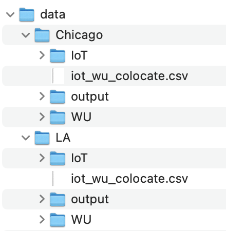

# Hourly Temperature Prediction in Python


## Preparing your dataset:

Dataset can be downloaded [here](https://exchangelabsgmu-my.sharepoint.com/:f:/g/personal/jyang43_masonlive_gmu_edu/En-TZLF4UVBAqyCtiyQOYM0BU3leFL4TSCJd18xoIXovGA?e=b3LTcq). Please contact the author Jingchao Yang (jyang43@gmu.edu) for direct access if link expires.



Place the dataset in the data folder before running the code 

Note: All data has been preprocessed to csv format, raw data can be accessed from [weather underground](https://www.wunderground.com/) and [GeoTab](https://data.geotab.com/weather/temperature). Toolset for preprocessing raw data can be accessed upon request.

## Requirements:
- Python 3.7
- PyTorch 1.7.0 (code has GPU support, but can run without) 
- Pandas 1.0.1
- scikit-learn
- scipy
- numpy
- matplotlib

## Category of models:

* [multistep_lstm](multistep_lstm) indludes python files for LSTM model building and training. 
* [multistep_others](multistep_others) includes comparison model ARIMA and XGBoost.


### - LSTM:

To run our LSTM model, go to the [directory](multistep_lstm) and using the command

```python run_auto.py --transLearn=False```

Argument "transLearn" controls regular model training (set to False) or transfer learning (set to True), more detail about transfer learning will be published in the next coming paper. LA Dataset already includes trained models and ready for transfer learning, user can delete the content inside the LA/output to retrain

Model output will be store in the data/output folder

[Tutorial](https://stackabuse.com/time-series-prediction-using-lstm-with-pytorch-in-python/) for LSTM using pytorch 


### - Other models 

Creat result folder under [multistep_others](multistep_others) for model output. ARIMA and XGBoost are for model comparison and were not developed for transfer learning 

#### - ARIMA:

To run our ARIMA model, go to [auto_arima_run.py](multistep_others/auto_arima_run.py)

[Tutorial](https://www.kaggle.com/sumi25/understand-arima-and-tune-p-d-q) for ARIMA 

#### - XGBoost:

To run our XGBoost model, go to [xgboost_run.py](multistep_others/xgboost_run.py)

[Tutorial](https://www.kaggle.com/furiousx7/xgboost-time-series) for XGBoost 
